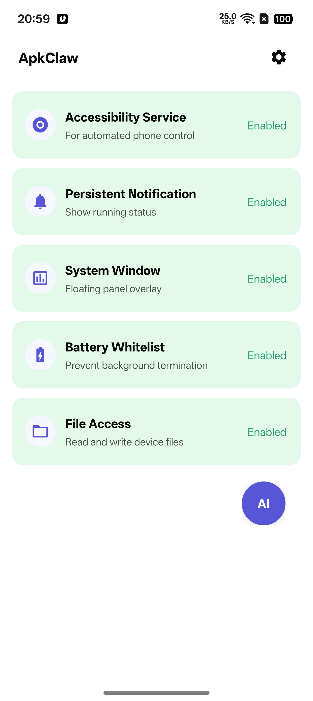
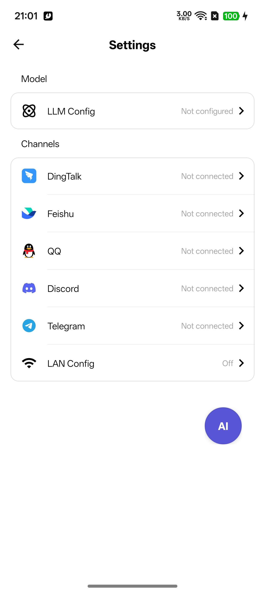

# ApkClaw

[English](README.md)

AI 驱动的 Android 自动化应用，通过自然语言让 LLM Agent 操控 Android 设备（手机）。用户通过消息渠道（钉钉、飞书、QQ、Discord、Telegram）发送指令，AI Agent 理解意图后自主执行设备操作。

## 截图

<p align="center">
  
  
</p>

## 架构概览

```
┌───────────────────────────────────────────────────────────────┐
│                      消息渠道                                  │
│   钉钉  │  飞书  │  QQ  │  Discord  │  Telegram  │  微信        │
└──────────────────────┬────────────────────────────────────────┘
                       │ 收到消息
                       ▼
              ┌─────────────────┐
              │  ChannelManager  │  消息路由与分发
              └────────┬────────┘
                       │
              ┌────────▼────────┐
              │ TaskOrchestrator │  任务锁、生命周期管理
              └────────┬────────┘
                       │
              ┌────────▼────────┐
              │  AgentService    │  Agent 循环
              │                  │
              │  ┌────────────┐  │
              │  │  LLM 调用  │◄─┼── LangChain4j (OpenAI / Anthropic)
              │  └─────┬──────┘  │
              │        │         │
              │  ┌─────▼──────┐  │
              │  │  工具执行   │◄─┼── ToolRegistry → ClawAccessibilityService
              │  └─────┬──────┘  │
              │        │         │
              │    循环直到       │
              │    任务完成       │
              └────────┬────────┘
                       │
                       ▼
              通过渠道回复用户
```

## Star History


## 构建

在 Windows 上，如果想稳定复现 debug 构建，直接使用项目自带脚本，不要手动拼 Gradle 参数：

```powershell
.\build-debug.bat
```

脚本会按顺序尝试 `APKCLAW_JBR`、`ANDROID_STUDIO_JBR`、`JAVA_HOME`，以及常见的 Android Studio JBR 路径。只有同时包含 `bin/java.exe` 和 `bin/jlink.exe` 的 Java 运行时才会被接受，然后脚本会在当前构建中固定使用该 JBR，并关闭 Gradle 的 Java 自动探测。

## 最近更新

- 首页已显示当前应用版本号，当前版本为 `0.0.4`。
- `maxIterations` 不再固定写死，现可在应用内的 LLM 配置页中设置。
- 新增等待时间设置页，可在 App 内配置全局缩放因子、点击等待、打开应用等待、输入后等待，并支持恢复默认值。
- Agent 系统提示词现在会注入当前生效的等待建议，不再依赖写死文案。
- 新增本地会话与记忆系统，并将“会话上下文”“全局记忆”“全局提示词”拆成独立开关。
- 会话与记忆页面支持预览和编辑当前选中会话的名称、近期会话记录、凝练摘要、习惯偏好、会话提示。
- 多会话聊天页支持直接发消息、停止任务、编辑会话内记忆字段，并持续刷新运行状态。
- 悬浮暂停输入改为覆盖层交互，支持继续任务、停止任务、发送补充提示，并提供明确的成功/失败反馈。
- 飞书支持通过文本命令控制会话/记忆开关，以及新建/切换会话。

## 开发历程

这一轮开发的重点不是“从零做一个 Agent 壳”，而是把 ApkClaw 逐步从可跑 Demo 推进到“可持续使用、可回看、可纠偏”的状态。整体演进大致分成 5 个阶段：

1. **构建与发布可复现化**：先解决 Windows 环境下调试构建不稳定的问题，固化 `build-debug.bat` / `build-debug.ps1`，让版本号、JBR 选择、APK 输出名可稳定复现。
2. **Agent 基础配置可控化**：把 `maxIterations`、LLM 配置等从硬编码改成 App 内设置，降低后续调参成本。
3. **会话与记忆体系落地**：补上会话上下文、凝练记忆、全局记忆、全局提示词，并支持会话内编辑、删除、新建、多会话切换。
4. **暂停与补充交互重做**：把“停止后重发”之外的另一种纠偏方式补齐，支持运行中暂停、补充提示、恢复执行，并逐步修正其 UI 与生命周期问题。
5. **等待时间策略配置化**：把过去只写在提示词里的等待经验改成真正可配置的系统参数，并同步清理旧会话中残留的等待配置对新任务的污染。

## 主要问题与解决路线

### 1. 构建环境不稳定

- **问题**：Windows 下每次构建都需要手工传 Java 参数，Android Studio JBR 路径不统一，构建命令不可复用。
- **解决路线**：提供项目内构建脚本，自动探测可用 JBR，并将 Gradle 的 Java 运行时固定到同一个来源。

### 2. Agent 配置过于写死

- **问题**：最大轮数、等待策略、模型配置都写在代码里，调试和回归成本高。
- **解决路线**：把运行配置迁移到设置页，并在 `AppViewModel -> AgentConfig -> AgentService` 这条链路上动态生效。

### 3. 会话能聊天，但不能管理长期信息

- **问题**：任务结束后缺少稳定的会话承接能力，停止任务和后续补充指令之间也无法区分“延续现场”和“重新来过”。
- **解决路线**：引入会话上下文、凝练记忆、全局记忆、全局提示词，并明确“已落盘上下文”和“运行中间态”的边界。

### 4. 历史记忆会污染当前任务

- **问题**：旧会话里残留的等待时间经验会继续影响新任务，即使当前设置已变更。
- **解决路线**：把当前等待时间策略完全收敛到系统提示词，同时对会话注入内容做清洗，过滤或截断历史 `wait_after` 配置说明。

### 5. 用户中途纠偏体验差

- **问题**：原本只能停掉任务再重发，或者暂停交互会把页面带回聊天页，打断当前现场。
- **解决路线**：把暂停输入改成悬浮覆盖层，提供继续、停止、发送补充三种明确动作，并给出即时反馈。

### 6. 聊天页与设置页细节影响可用性

- **问题**：聊天页自动滚动、按钮顺序、文案中英文混杂、设置页说明过长等问题会显著影响使用体验。
- **解决路线**：逐步把这些问题当作“长期使用的阻碍”来修，而不是把它们视为纯 UI 微调。

## 核心执行流程

1. **用户**通过任意已连接的渠道发送自然语言消息
2. **ChannelSetup** 校验无障碍服务是否已开启
3. **TaskOrchestrator** 获取任务锁（单任务模型），按 Home 键重置设备状态
4. **DefaultAgentService** 进入 Agent 循环：
   - 构建系统提示词，注入设备上下文（品牌、型号、分辨率、已注册工具）
   - 调用 LLM 并传入工具定义（通过 LangChain4j 桥接层）
   - 从 LLM 响应中提取工具调用
   - 通过 **ToolRegistry** → **ClawAccessibilityService** 执行工具
   - 将工具执行结果反馈给 LLM
   - 循环直到调用 `finish` 工具或达到当前配置的最大迭代次数上限
5. **结果**通过同一渠道回复给用户

## Agent 系统

### Agent 循环 (`DefaultAgentService`)

Agent 遵循 **观察 → 思考 → 行动 → 验证** 协议：

- **系统提示词**：注入设备信息（品牌、型号、Android 版本、屏幕分辨率）、已注册工具列表和安全约束
- **LLM 调用重试**：最多 3 次尝试，指数退避（1s → 2s → 4s），遇到 401/403 时不重试
- **死循环检测**：维护 4 轮滑动窗口 `(screenHash, toolCall)` 指纹，若全部相同则注入系统消息强制 Agent 换一种方式
- **Token 优化**：将历史 `get_screen_info` 结果替换为占位符以节省 token，仅保留最近一次
- **系统弹窗处理**：当 `getRootInActiveWindow()` 返回 null（检测到受保护的系统弹窗）时，截图发送给用户并终止任务

### LLM 集成

通过 `LlmClientFactory` 实现可插拔的 LLM 后端：

| 提供商      | 客户端类             | 模型构建器                                           |
| ----------- | -------------------- | ---------------------------------------------------- |
| OpenAI 兼容 | `OpenAiLlmClient`    | `OpenAiChatModel` / `OpenAiStreamingChatModel`       |
| Anthropic   | `AnthropicLlmClient` | `AnthropicChatModel` / `AnthropicStreamingChatModel` |

均支持流式和非流式模式。HTTP 层使用自定义的 `OkHttpClientBuilderAdapter`（基于 OkHttp）替代 JDK HttpClient 以兼容 Android。

**配置项** (`AgentConfig`)：

- `apiKey`：来自本地设置
- `baseUrl`：LLM 端点（默认：`https://api.openai.com/v1`）
- `modelName`：用户可选
- `provider`：`OPENAI`（默认）或 `ANTHROPIC`
- `temperature`：0.1（确定性输出）
- `maxIterations`：可在 LLM 配置页设置（默认 60）
- `streaming`：可配置（默认关闭）

## 会话与记忆系统

应用现在内置了本地持久化的会话与记忆系统，数据保存在设备本地。

- **会话上下文**：保存近期会话任务记录，可作为短期上下文注入到后续任务中。
- **凝练记忆**：保存较长期的凝练摘要、用户习惯和错误经验。
- 会话上下文与凝练记忆可以分别开关，便于按需控制 token 消耗。
- “Session & Memory” 页面支持：
  - 独立开启/关闭会话上下文
  - 独立开启/关闭凝练记忆
  - 选择当前会话
  - 新建会话
  - 预览并编辑会话名称、近期任务、凝练摘要、习惯偏好、错误经验

### 已落盘会话上下文 vs 运行中间态

- **已落盘的会话上下文**：指已经保存到本地会话记录里的内容，例如历史消息、近期任务记录、凝练摘要、习惯偏好、会话提示等。停止当前任务后，下一个新任务仍然可以重新读取这些内容，因此它能“继承会话”。
- **上一次运行时的中间态**：指只存在于当前那次 Agent 执行过程中的即时状态，例如已经看到但还没写入会话的当前页面观察结果、正在进行中的工具调用链、当前轮次内部推理节奏、还没结束的执行栈和暂停点。这些状态不会作为完整运行快照持久化，因此停止任务后不能直接续上。

这两者的区别在于：

- 新任务能继承的是“已经写进本地存储的上下文”，所以 AI 知道你们之前聊过什么、做过什么。
- 新任务不能继承的是“上一次执行到一半的现场”，所以它不会从上一次尚未完成的工具链条中间继续跑，而是会基于已保存的会话信息重新规划下一步。

### 暂停补充 vs 停止后再发送

- **暂停后补充提示**：当前任务先暂停，补充指令会直接进入这次正在运行的 Agent 队列，然后继续执行。这样会保留当前任务的运行中间态，更适合“别重来，沿着现在这一步继续改”。
- **停止后再发送提示**：当前任务会先被彻底取消。你之后发出的新消息会作为一个新任务启动，只会读取已经落盘的会话上下文，不会保留上一个任务停下时的即时执行状态，更适合“放弃刚才那条执行路线，重新来一轮”。

当前限制：会话和记忆目前仍然是设备本地全局状态，还没有做到按远程用户身份隔离。

## 飞书命令

飞书现在可以通过普通文本命令在任务执行前控制会话与记忆功能：

```text
/memory on
/memory off
/memory status

/session on
/session off
/session status
/session list
/session new 日常飞书运营
/session use session-default
/session current
```

这些命令会在进入正常任务执行前被拦截处理，因此不会占用一次正常任务执行。

### LangChain4j 桥接层

`LangChain4jToolBridge` 将自定义的 `BaseTool` 抽象转换为 LangChain4j 的 `ToolSpecification` 格式，将参数类型（`string`、`integer`、`number`、`boolean`）映射为 JSON Schema。

## 工具系统

工具按设备类型在 `ToolRegistry` 中注册：

### 通用工具（所有设备）

| 工具                                              | 说明                               |
| ------------------------------------------------- | ---------------------------------- |
| `get_screen_info`                                 | 获取 UI 层级树，供 AI 分析当前界面 |
| `find_node_info`                                  | 通过文本或资源 ID 查找元素         |
| `take_screenshot`                                 | 截取当前屏幕为 PNG                 |
| `input_text`                                      | 向焦点输入框输入文本               |
| `open_app`                                        | 通过名称打开应用                   |
| `get_installed_apps`                              | 获取已安装应用列表                 |
| `press_back` / `press_home`                       | 返回 / 回到桌面                    |
| `open_recent_apps`                                | 打开最近任务                       |
| `expand_notifications` / `collapse_notifications` | 展开 / 收起通知栏                  |
| `lock_screen`                                     | 锁屏                               |
| `wait`                                            | 等待指定时长                       |
| `repeat_actions`                                  | 重复执行一组操作                   |
| `send_file`                                       | 通过渠道发送文件给用户             |
| `finish`                                          | 完成任务并返回总结                 |

### 手机专属工具

| 工具                  | 说明                 |
| --------------------- | -------------------- |
| `tap`                 | 点击指定坐标 (x, y)  |
| `long_press`          | 长按指定坐标         |
| `swipe`               | 从 A 点滑动到 B 点   |
| `click_by_text`       | 通过可见文字点击元素 |
| `click_by_id`         | 通过资源 ID 点击元素 |
| `search_app_in_store` | 在应用商店中搜索应用 |

每个工具继承 `BaseTool`，实现 `execute(Map<String, Any>): ToolResult`，提供中英文双语描述和类型化参数声明。

## 渠道系统

| 渠道     | 协议                     | 所需凭证                  |
| -------- | ------------------------ | ------------------------- |
| 钉钉     | App Stream Client        | Client ID + Client Secret |
| 飞书     | OAPI SDK                 | App ID + App Secret       |
| QQ       | QQ Bot API               | App ID + App Secret       |
| Discord  | Gateway WebSocket + REST | Bot Token                 |
| Telegram | Bot HTTP API             | Bot Token                 |

渠道凭证可通过应用内设置页或局域网 HTTP 服务器（`http://<设备IP>:9527`）配置。

## 无障碍服务

`ClawAccessibilityService`（Java）是设备交互的核心层：

- **手势操作**：通过 `dispatchGesture()` 实现点击、滑动、长按
- **节点遍历**：通过 `getRootInActiveWindow()` 获取 UI 层级树
- **按键注入**：通过 `performGlobalAction()` 实现 Home、返回、最近任务
- **截屏**：`takeScreenshot()`（需 Android 11+）

**已知限制**：系统保护窗口（如 `com.android.permissioncontroller` 的权限弹窗）会同时阻止节点树读取和手势注入（`filterTouchesWhenObscured` 机制）。Agent 检测到此情况后会截图通知用户手动处理。

## 局域网配置服务器

基于 NanoHTTPD 的 HTTP 服务器运行在端口 9527，方便通过 PC 浏览器配置设备：

| 端点            | 方法     | 用途               |
| --------------- | -------- | ------------------ |
| `/`             | GET      | 配置页面           |
| `/api/channels` | GET/POST | 读取/更新渠道凭证  |
| `/api/llm`      | GET/POST | 读取/更新 LLM 配置 |

通过 GET 获取时，敏感信息会做脱敏处理（仅显示末尾 4 位字符）。Debug 构建额外提供 `/debug.html` 工具调试控制台。

## 项目结构

```
app/src/main/java/com/apk/claw/android/
├── agent/                  # Agent 循环、配置、回调
│   ├── langchain/          # LangChain4j 桥接层 & OkHttp 适配器
│   └── llm/                # LLM 客户端 (OpenAI, Anthropic)
├── base/                   # BaseActivity（屏幕密度适配）
├── channel/                # 消息渠道处理器
│   ├── dingtalk/
│   ├── feishu/
│   ├── qqbot/
│   ├── discord/
│   └── telegram/
├── floating/               # 悬浮球 UI 管理
├── server/                 # 局域网配置 & 调试 HTTP 服务器
├── service/                # 无障碍服务、前台服务、保活服务
├── tool/                   # 工具抽象层 & 注册中心
│   └── impl/               # 工具实现 (通用/手机/电视)
├── ui/                     # Activity（启动页、首页、引导页、设置）
├── utils/                  # KVUtils, XLog, 格式化工具
└── widget/                 # 自定义 UI 组件
```

## 构建与运行

### 环境要求

- Java 17+
- Android Studio（建议 Ladybug 或更高版本）
- Android SDK 36（编译/目标），最低 SDK 28

### 编译

```bash
# 克隆仓库
git clone https://github.com/apkclaw-team/ApkClaw.git
cd ApkClaw

# Debug 构建
./gradlew assembleDebug

# Release 构建
./gradlew assembleRelease
```

### 配置与使用

1. **安装** APK 到 Android 设备（Android 9+）
2. **授权** — 在首页依次开启所有必要权限（无障碍服务、通知权限、悬浮窗、电池白名单、文件访问）
3. **配置 LLM** — 进入 设置 > LLM Config，填写：
   - **API Key**：你的 OpenAI 或 Anthropic API Key
   - **Base URL**：LLM 接口地址（默认 `https://api.openai.com/v1`，使用第三方服务商请修改）
   - **Model Name**：例如 `gpt-4o`、`claude-sonnet-4-20250514`
4. **配置渠道** — 进入设置，选择至少一个消息渠道（钉钉 / 飞书 / QQ / Discord / Telegram），填写机器人凭证
5. **发送消息** — 通过已配置的渠道发送消息，即可开始控制设备

> **提示**：你也可以通过局域网在 PC 浏览器上配置。在设置中开启 LAN Config，然后在 PC 上访问 `http://<设备IP>:9527`。

## 主要依赖

**AI / Agent**

| 依赖                                                      | 版本   | 用途                           |
| --------------------------------------------------------- | ------ | ------------------------------ |
| [LangChain4j](https://github.com/langchain4j/langchain4j) | 1.12.2 | Agent 编排、工具定义、LLM 集成 |

**消息渠道**

| 依赖                                                                                | 版本   | 用途     |
| ----------------------------------------------------------------------------------- | ------ | -------- |
| [DingTalk Stream Client](https://github.com/open-dingtalk/dingtalk-stream-sdk-java) | 1.3.12 | 钉钉渠道 |
| [Feishu OAPI SDK](https://github.com/larksuite/oapi-sdk-java)                       | 2.5.3  | 飞书渠道 |

**网络**

| 依赖                                                | 版本   | 用途                          |
| --------------------------------------------------- | ------ | ----------------------------- |
| [OkHttp](https://github.com/square/okhttp)          | 4.12.0 | HTTP 客户端（LLM 调用）       |
| [Retrofit](https://github.com/square/retrofit)      | 2.11.0 | REST API 客户端               |
| [NanoHTTPD](https://github.com/NanoHttpd/nanohttpd) | 2.3.1  | 局域网配置 & 调试 HTTP 服务器 |

**存储 & 工具**

| 依赖                                                  | 版本   | 用途               |
| ----------------------------------------------------- | ------ | ------------------ |
| [MMKV](https://github.com/Tencent/MMKV)               | 2.3.0  | 高性能本地键值存储 |
| [Gson](https://github.com/google/gson)                | 2.13.2 | JSON 序列化        |
| [ZXing](https://github.com/zxing/zxing)               | 3.5.3  | 二维码生成         |
| [UtilCode](https://github.com/Blankj/AndroidUtilCode) | 1.31.1 | Android 工具函数库 |

**UI**

| 依赖                                                  | 版本  | 用途                      |
| ----------------------------------------------------- | ----- | ------------------------- |
| [Glide](https://github.com/bumptech/glide)            | 5.0.5 | 图片加载                  |
| [EasyFloat](https://github.com/princekin-f/EasyFloat) | 2.0.4 | 悬浮窗                    |
| [MultiType](https://github.com/drakeet/MultiType)     | 4.3.0 | RecyclerView 多类型适配器 |

## License

```
Copyright 2026 ApkClaw

Licensed under the Apache License, Version 2.0 (the "License");
you may not use this file except in compliance with the License.
You may obtain a copy of the License at

    http://www.apache.org/licenses/LICENSE-2.0

Unless required by applicable law or agreed to in writing, software
distributed under the License is distributed on an "AS IS" BASIS,
WITHOUT WARRANTIES OR CONDITIONS OF ANY KIND, either express or implied.
See the License for the specific language governing permissions and
limitations under the License.
```
